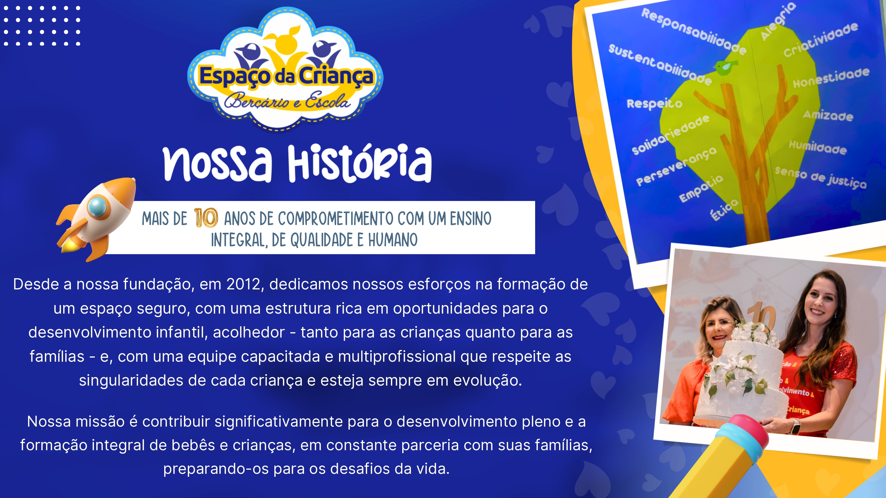
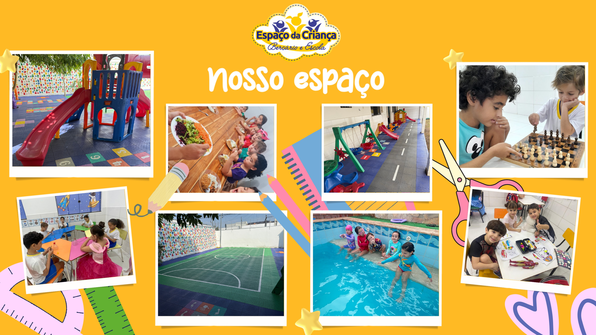
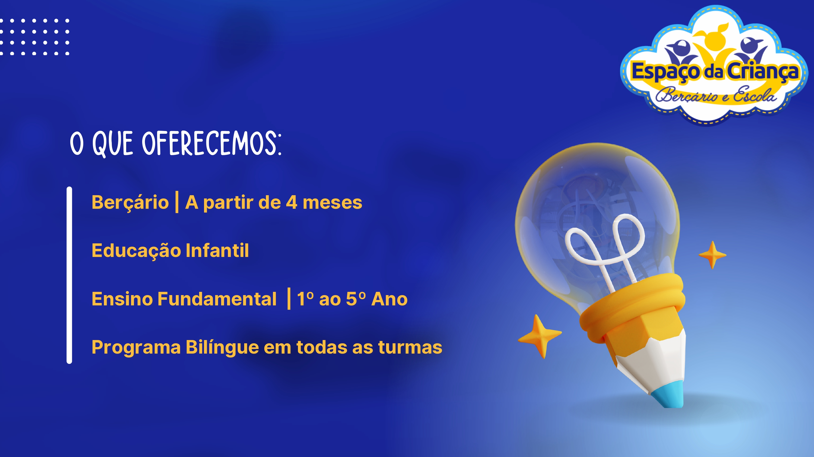

<p align="center">
  
</p>

<h1 align="center">Espaço da Criança</h1>

<p align="center">
  Site institucional da escola <strong>Espaço da Criança</strong> — berçário, educação infantil e ensino fundamental em Cuiabá/MT.
</p>

<p align="center">
  
</p>

<p align="center">
  <em>Aprender, brincar e crescer com amor</em>
</p>

---

## Sobre o projeto

O **Espaço da Criança** é um site moderno e responsivo desenvolvido para apresentar a escola às famílias, destacar diferenciais pedagógicos, turmas, atividades extracurriculares e canais de contato.

Fundada em **2009**, a escola oferece:

- Berçário (a partir de 4 meses)
- Educação Infantil (2 a 5 anos)
- Ensino Fundamental I (1º ao 5º ano)
- Educação bilíngue (SAS + Bilíngue)
- Aulas inclusas: robótica, natação, música e xadrez
- Atividades extras: ballet, judô e escolinha de natação

## Prévia visual

<table>
  <tr>
    <td align="center">
      
      <br /><sub>Página institucional</sub>
    </td>
    <td align="center">
      
      <br /><sub>Diferenciais e metodologia</sub>
    </td>
  </tr>
  <tr>
    <td align="center">
      
      <br /><sub>Turmas e programas educacionais</sub>
    </td>
    <td align="center">
      
      <br /><sub>Atividades e estrutura</sub>
    </td>
  </tr>
</table>

## Funcionalidades

| Página / Seção | Descrição |
|----------------|-----------|
| **Home** | Hero animado, estatísticas, diferenciais, turmas, depoimentos, galeria, aulas, horários e contato |
| **Quem Somos** | História, missão/visão/valores, metodologia, projetos integrados e equipe multiprofissional |
| **Turmas** | Detalhes de berçário, educação infantil e ensino fundamental |
| **Área dos Pais** | Links para os apps ClipEscola e WD-MOB V2 |

### Destaques técnicos

- Navegação com **React Router**
- Layout responsivo com menu mobile
- Elementos decorativos animados (foguetes, nuvens, estrelas)
- Formulário de contato e integração com **WhatsApp**
- Mapa com localização da escola
- Galeria de fotos com modal
- Carrossel de depoimentos de pais

## Tecnologias

<p>
  
  
  
</p>

- [React](https://react.dev/) 19
- [Vite](https://vite.dev/) 8
- [React Router DOM](https://reactrouter.com/) 7
- CSS-in-JS (estilos globais em `src/styles/global.css.js`)

## Paleta de cores

| Cor | Hex | Uso |
|-----|-----|-----|
| Azul | `#2E3192` | Títulos, navegação |
| Azul claro | `#2EA7E0` | Destaques |
| Amarelo | `#FDB913` | Botões e acentos |
| Amarelo claro | `#FFE29A` | Fundos suaves |

## Como executar

### Pré-requisitos

- [Node.js](https://nodejs.org/) 18 ou superior
- npm

### Instalação

```bash
# Clone o repositório
git clone <url-do-repositorio>
cd espacodacrianca

# Instale as dependências
npm install

# Inicie o servidor de desenvolvimento
npm run dev
```

O site estará disponível em `http://localhost:5173`.

### Outros comandos

```bash
npm run build    # Gera a versão de produção em dist/
npm run preview  # Visualiza o build de produção localmente
npm run lint     # Executa o ESLint
```

## Estrutura do projeto

```
espacodacrianca/
├── docs/
│   └── images/              # Imagens usadas neste README
├── public/
│   └── images/              # Fotos do site (hero, turmas, aulas, etc.)
├── src/
│   ├── assets/images/       # Logo, foguete e logos dos apps
│   ├── components/          # Componentes reutilizáveis
│   ├── data/constants.js    # Conteúdo e configurações do site
│   ├── hooks/               # Hooks customizados
│   ├── pages/               # Páginas principais
│   ├── styles/              # Estilos globais
│   ├── App.jsx
│   └── main.jsx
├── INSTRUCOES_FOTOS.md      # Guia para adicionar fotos
├── INSTRUCOES_IMAGENS.md    # Guia para logo e foguete
├── INSTRUCOES_LOGOS_APPS.md # Guia para logos dos aplicativos
└── package.json
```

## Imagens do site

Algumas imagens já estão em `src/assets/images/`:

| Arquivo | Uso |
|---------|-----|
| `logo.jpeg` | Logo da escola |
| `foguete.png` | Elemento decorativo animado |
| `logo_clipescola.png` | Logo do app ClipEscola |
| `WD-MOB V2.png` | Logo do app WD-MOB V2 |

Para as fotos das seções (hero, diferenciais, turmas, aulas e história), adicione os arquivos em `public/images/` conforme os guias:

- [INSTRUCOES_FOTOS.md](INSTRUCOES_FOTOS.md)
- [INSTRUCOES_IMAGENS.md](INSTRUCOES_IMAGENS.md)
- [INSTRUCOES_LOGOS_APPS.md](INSTRUCOES_LOGOS_APPS.md)

> As fotos em `public/images/` são carregadas automaticamente. Se um arquivo não existir, o componente oculta a imagem sem quebrar o layout.

## Apps para pais

<p>
  
</p>

- **ClipEscola** — Acompanhe o dia a dia, comunicados e fotos
- **WD-MOB V2** — Acesso às informações escolares no celular

Disponíveis na [Google Play](https://play.google.com) e [App Store](https://apps.apple.com).

## Contato da escola

| | |
|---|---|
| **WhatsApp** | [+55 65 3025-5865](https://wa.me/556530255865) |
| **E-mail** | espacodacrianca-bei@hotmail.com |
| **Endereço** | Rua Castro Alves, 06, Quadra 28, Santa Cruz 1, Cuiabá - MT |
| **Instagram** | [@espacodacriancamt](https://www.instagram.com/espacodacriancamt/) |

## Horários de funcionamento

| Modalidade | Horários |
|------------|----------|
| Integral | 06:45 às 18:45* |
| Meio-período | 06:45 às 12:00 / 13:00 às 18:45* |
| Semi-integral | 06:45 às 15:00 / 10:00 às 18:45* |

---

<p align="center">
  
  <br />
  <strong>Espaço da Criança</strong> — Berçário e Escola · Cuiabá, MT
</p>
